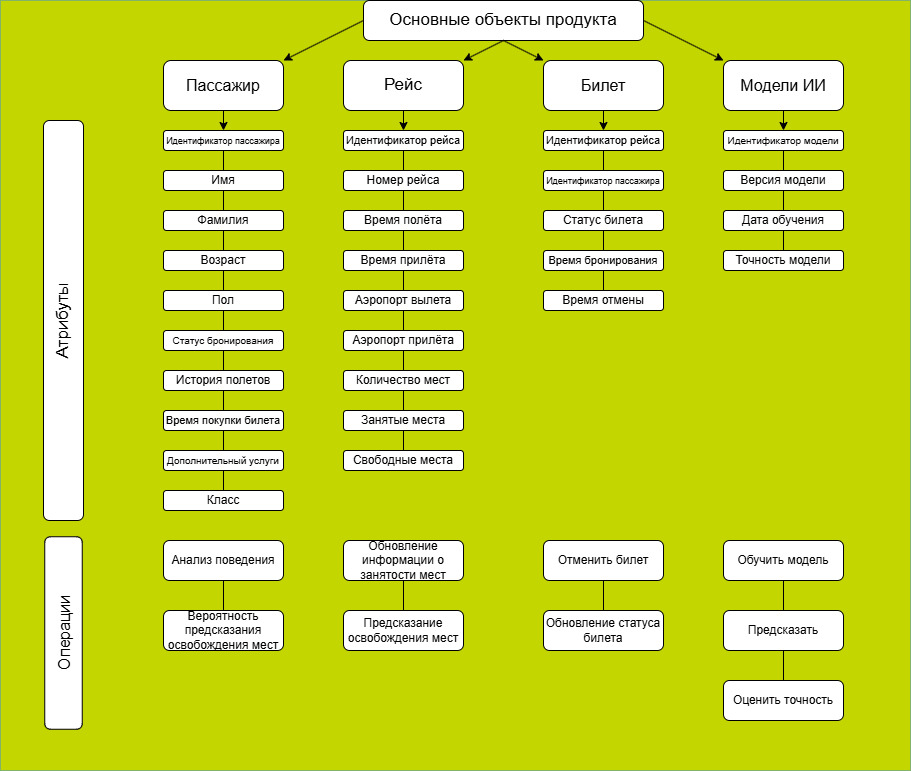

# Аналитические артефакты и описание проекта

## 1) Основные объекты продукта

>

>   
>

На диаграмме представлены основные объекты системы, включая пользователей, рейсы, билеты, и прогнозы. Система взаимодействует с пользователями через интерфейс, который позволяет им просматривать доступные рейсы, получать прогнозы появления свободных билетов и подписываться на уведомления.

## 2) Ролевая модель

Пользователи - клиенты авиакомпании S7, которые хотят купить авиабилеты. В системе они выполняют роль клиента.

Ограничения пользователей:
- Пользователи могут только просматривать доступные рейсы и подписываться на уведомления.
- Они не имеют доступа к внутренним данным системы, таким как история отказов других пассажиров или детали алгоритмов прогнозирования.

## 3) Пользовательские/Функциональные/Нефункциональные требования

>Определите требования для реализации решения, распределите требования на виды. Пользовательские требования могут быть представлены в виде диаграмм.

### Пользовательские требования:
Функциональность:
- Прогноз отказов – система анализирует историю отказов пассажиров и формирует вероятностную модель, которая предсказывает вероятность появления свободного билета на конкретный рейс.
- Оповещения – если вероятность отказа высока, пользователь может подписаться на уведомления, чтобы быть в курсе появления свободных мест.
- Лист ожидания – система автоматически резервирует билет для пользователя, если другой пассажир отказывается от бронирования.

Технологии:
- ML-модель – на основе истории покупок, отказов, сезонности и времени до вылета строится модель машинного обучения, которая прогнозирует вероятность появления свободных мест.
- Push-уведомления – интеграция с системой push-уведомлений для своевременного оповещения пользователей.
- Анализ данных – система анализирует анонимные данные о пассажирах, включая их "репутацию" отказов, чтобы улучшить точность прогнозов.

### Фукнциональные требования:
- При открытии пользователем специального окна, система должна сделать прогноз освобождения места, и вывести его пользователю.
- В случае, если пользователь отметил, что он хочет следить за статусом рейса, система должна оповестить пользователя, если появился свободный билет.

### Нефункциональные требования:
- Система должна без задержек давать прогноз и выводить его пользователю.
- При изменении статуса рейса, система должна оповестить каждого пользователя, который выбрал отслеживание данного рейса.
   
## 4) Прототипы интерфейса
>Опишите возможности вашего интерфейса. Какие существуют экранные формы? Как различные пользователи взаимодействуют с вашим интерфейсом?

После перехода к выбору билетов, помимо рейсов, на которые есть свободные билеты, появляются рейсы без свободных билетов. Рядом с таким рейсом будет расположено окно в стилистике S7, в котором будет выведена вероятность появления свободного билета.

Пользователь может нажать на кнопку "Подписаться на уведомления", чтобы получать оповещения о появлении свободных мест.

[Пример работы](./S7.mp4)

## 5) Перспективы расширения системы

>Представьте, что вы не ограничены во времени разработки решения.

- Гибкое ценообразование – система может предсказывать цену билета в случае отказа другого пассажира, что позволит предлагать пользователям более выгодные условия.
- Предоплата за "шанс" – пользователь может оплатить небольшой сбор за приоритет в листе ожидания, что увеличит его шансы на получение билета.
- Социальная аналитика – система может анализировать анонимные "паттерны отказов" (например, в бизнес-классе чаще отказываются за сутки, в экономе – в последний момент) и использовать эти данные для улучшения прогнозов.
- AI-консьерж – ИИ-ассистент, который помогает пользователю найти альтернативные варианты, такие как пересадки, соседние рейсы или апгрейд класса обслуживания.
- Интеграция с корпоративными аккаунтами – компании могут покупать "резервные" билеты для своих сотрудников, что упрощает процесс бронирования для корпоративных клиентов.

Дополнительные функции для будущего развития:
- Интеграция с другими авиакомпаниями – расширение системы для работы с рейсами других авиакомпаний, что увеличит количество доступных вариантов для пользователей.
- Персонализированные рекомендации – на основе истории поиска и покупок система может предлагать пользователям персонализированные рекомендации по рейсам и направлениям.
- Расширенная аналитика для авиакомпаний – предоставление авиакомпаниям аналитических отчетов о поведении пассажиров, что поможет им оптимизировать свои бизнес-процессы.

>Какие функции вы бы хотели добавить? Как мог бы развиваться ваш продукт в будущем?

**Инструменты для оформления решения**
> [!NOTE]
> Для вставки диаграмм/экранных форм используйте HTML-тэг "img". Диграмму нужно загрузить файлом в папку Desc и прописать внутри тэга её название. Формат изображений .png, .img/
> Пример вставки диаграммы
>

>   
>

> Для создания и оформления таблиц используйте документацию - https://docs.github.com/ru/get-started/writing-on-github/working-with-advanced-formatting/organizing-information-with-tables
>
> Пример таблицы https://github.com/s7-ai-wings/template-artifact/blob/main/Idea/README.md
>
>  Другие возможности оформления md-страниц в Github - https://docs.github.com/ru/get-started

