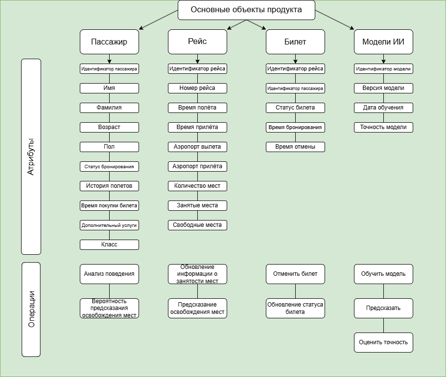

# Аналитические артефакты и описание проекта
Вторым этапом опишите аналитические артефакты. Используйте доступные и известные вам инструменты для описания: текст, таблицы, схемы и диаграммы. В информации ниже представлен порядок описания артефактов, вводная информация  и наводящие вопросы по каждому из них. 

Результат выполения этой части хакатона - это техническое задание на разработку решения вашей идеи.

**Порядок описания аналитических артефактов:**
1) Основные объекты продукта

>

>   
>

2) Ролевая модель

>Вам помогут вопросы:
>Кто ваши пользователи?
>Какие функции они выполняют в системе?
>Как продукт определяет пользователя и есть ли у пользователя ограничения?
>Какие образом назначаются роли?

- Пользователи - клиенты S7, которым требуется купить авиабилет.
- В системе они выполняют роль клиента
- У пользователя стандартные органичения клиента.

3) Пользовательские/Функциональные/Нефункциональные требования

>Определите требования для реализации решения, распределите требования на виды. Пользовательские требования могут быть представлены в виде диаграмм.

Пользовательские требования:
Функциональность:
Прогноз отказов – анализ истории отказов пассажиров и формирование вероятностной модели.
Оповещения – если вероятность отказа высока, пользователь может подписаться на уведомления.
Лист ожидания – автоматическое резервирование билета при отказе других пассажиров.

Технологии:
ML-модель на основе истории покупок, отказов, сезонности, времени до вылета.
Интеграция с push-уведомлениями.
Анализ данных о пассажирах (анонимный, но на основе «репутации» отказов).

Фукнциональные требования:
- При открытии пользователем специального окна, система должна сделать прогноз освобождения места, и вывести его пользователю.
- В случае, если пользователь отметил, что он хочет следить за статусом рейса, система должна оповестить пользователя, если появился свободный билет.

Нефункциональные требования:
- Система должна без задержек давать прогноз и выводить его пользователю.
- При изменении статуса рейса, система должна оповестить каждого пользователя, который выбрал отслеживание данного рейса.
   
4) Прототипы интерфейса
>Опишите возможности вашего интерфейса. Какие существуют экранные формы? Как различные пользователи взаимодействуют с вашим интерфейсом?

В блоке покупки билета на рейс, в котором закончились билеты, теперь есть кнопка, нажимая на которую, рядом появляется вероятность того, что в течении какого-то времени появятся билеты на этот рейс, а также при освобождении места система оповещает пользователя. Кнопка будет в стилистике S7 - квадрат с гладкими углами. Пользователь нажимает на кнопку и видит вероятность. 

>При наличии дизайнера в команде интерфейсы должны соответствовать [дизайну продуктов S7](https://www.s7.ru/ru/info/s7-airlines/brand/). Если дизайнера в команде нет, можно ограничиться схемами экранных форм.

5) Перспективы расширения системы

>Представьте, что вы не ограничены во времени разработки решения.

Гибкое ценообразование – предсказание цены билета в случае отказа.
Предоплата за "шанс" – пользователь может оплатить небольшой сбор за приоритет в листе ожидания.
Социальная аналитика – анонимные «паттерны отказов» (например, в бизнес-классе чаще отказываются за сутки, в экономе – в последний момент).
AI-консьерж – ИИ-ассистент, который помогает найти альтернативные варианты (пересадки, соседние рейсы, апгрейд).
Интеграция с корпоративными аккаунтами – компании могут покупать "резервные" билеты.
>Какие функции вы бы хотели добавить? Как мог бы развиваться ваш продукт в будущем?

**Инструменты для оформления решения**
> [!NOTE]
> Для вставки диаграмм/экранных форм используйте HTML-тэг "img". Диграмму нужно загрузить файлом в папку Desc и прописать внутри тэга её название. Формат изображений .png, .img/
> Пример вставки диаграммы
>

>   
>

> Для создания и оформления таблиц используйте документацию - https://docs.github.com/ru/get-started/writing-on-github/working-with-advanced-formatting/organizing-information-with-tables
>
> Пример таблицы https://github.com/s7-ai-wings/template-artifact/blob/main/Idea/README.md
>
>  Другие возможности оформления md-страниц в Github - https://docs.github.com/ru/get-started

